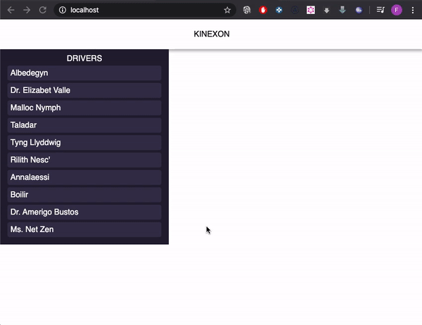

# FULL STACK DEVELOPER CODING CHALLENGE

### Run:
- Clone it
- `docker-compose up`

### Runing tests:
- Clone it
- `cd server`
- `npm install`
- `npm run test`

### Runing dev mode server:
- Clone it
- `cd server`
- `npm install`
- `npm run dev`

### Runing dev mode client:
- Clone it
- `cd client`
- `npm install`
- `npm start`